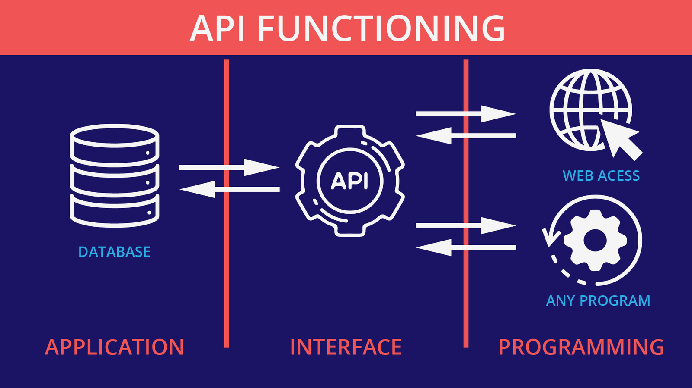
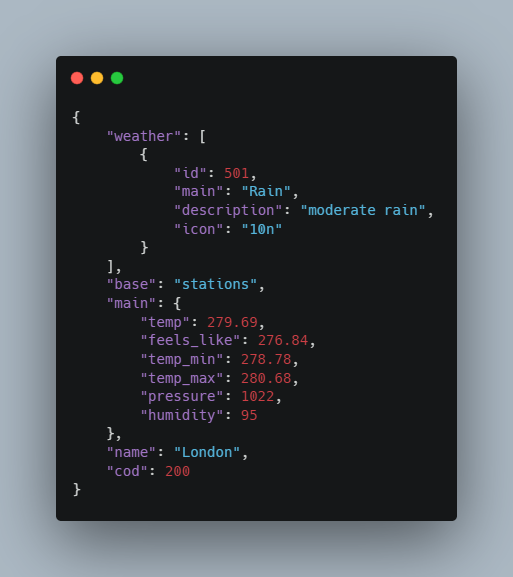

# INTRODUCTION TO APIs (Application Programming Interfaces)

An API is a set of programming codes that enables data transmission between one software product and another.

This is the basic definition of APIs. Let's do a deep dive to truly understand it. API stands for Application Programming Interface. It can act as a bridge between two applications, products to share the data.

Suppose we are going on a weather application. It will display weather information according to the location provided by the user. Let's divide our application into 3 parts: frontend(application), database, and the API.

**Frontend**: This is the frontend part of our application containing all the UI design, Javascript, and containers.

**Database**: It contains all the data regarding the weather. The data in the database is stored and managed by a different organization. This is data that keeps on updating at a regular time interval.

**API**: Our frontend needs data from the database to be able to perform its task. So here the API provides a bridge between the frontend and the database. This API will help in exchanging the data between the two

API Endpoints: It is the point at which the two elements, here database and frontend, communicate with each other. Web-based API has URLs as endpoints. For example:

- https://swapi.dev/api/people

- https://disease.sh/v3/covid-19/vaccine/coverage/countries?lastdays=1

### Examples of APIs

## OpenWeatherMap [https://openweathermap.org/]

As the name suggests, it's a weather API. It provides data related to a weather app. It’s free and refreshes every 5 minutes. It supports most of the major locations around the world. Its free trial is best for developing a weather website.

## TheMovieDB [https://developers.themoviedb.org/3]

In my opinion, it is the best free movie-based API available on the internet. It has many endpoints for different queries such as popularity, year, movies, series. etc. You can develop a movie and series tracker with this API, or anything else your imagination comes up with.

## Frankfurter [https://www.frankfurter.app/]

It is a currency exchange rate monitor API. It has the latest as well as the historical data for the exchange rate.

## Types of APIs

There are 3 major API types based on their architecture:

### REST APIs

REST stands for representational state transfer. It is also known as RESTful API. It is the most common way of developing a web-based API. It uses a server/client approach to transfer data. When a client calls the API, the server responds by providing the data.

Data Received from a REST API:

